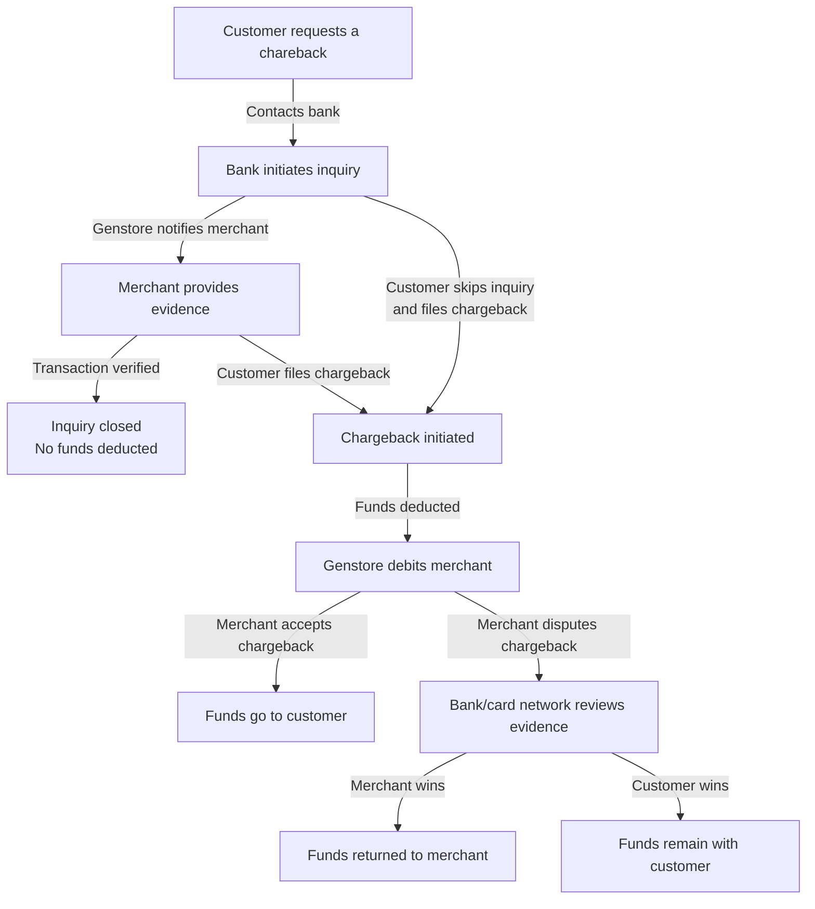

# Chargebacks and inquiries

If your store accepts credit card payments, there may be times when a customer disputes a transaction—either because they don’t recognize the charge, believe the product or service was not delivered as promised, or suspect fraudulent activity. In such cases, you may receive either a **chargeback** or an **inquiry**: 

- A **chargeback**,  where funds are forcibly returned to the buyer; or,
- An **inquiry**, which is a request for more information about the transaction before a chargeback is initiated. At this stage, no money is deducted—it's simply a request for more information.

## How it works

When a cardholder questions a charge, they may first reach out to their bank. The bank can initiate an **inquiry**, requesting evidence from you (the merchant) to confirm the transaction was valid. If the issue escalates, the customer may file a **chargeback**.

As soon as Genstore Payment receives a chargeback notice, we’ll deduct the disputed amount—and any associated fees—from your account balance or pending payouts.

You can choose to either accept the chargeback or fight it by submitting relevant documentation. If your dispute is successful, the funds will be returned to you. If not, the buyer keeps the funds. Chargeback fees and policies may vary depending on your region.

## Chargeback vs. refund: What's the difference?

Chargebacks are often confused with refunds. The differences are:

|**Aspect**|**Chargeback**|**Refund**|
|---|---|---|
|**Initiator**|**Buyer (cardholder)** through the issuing bank or card scheme|**Merchant** initiates (e.g., mutual agreement)|
|**Process path**|Buyer → Issuing Bank → Card Scheme → Merchant|Buyer → Merchant → Genstore (no bank involvement)|
|**Funds handling**|Forced deduction from merchant account, may incur fees|Merchant-initiated refund via payment channel, no extra fees|
|**Dispute decision**|**Bank or card scheme** decides, merchant provides evidence|**Resolved between merchant and buyer** (e.g., return or compensation)|
|**Processing time**|Complex process, usually takes 30–90 days|Simple process, may be instant depending on channel|
|**Merchant control**|Passive response, must submit evidence within deadline|Merchant controls refund timing and amount|
|**Cost impact**|Possible chargeback fees; refund policies vary by scheme|Only standard transaction fees|
|**Account impact**|High chargeback rate may result in **frozen account or restricted transactions**|Reasonable refunds don't affect account, but frequent ones may hurt credibility|
|**Typical scenarios**|Undelivered items, fraud, unapproved quality complaints|Defects, delays, cancellations mutually agreed upon|

