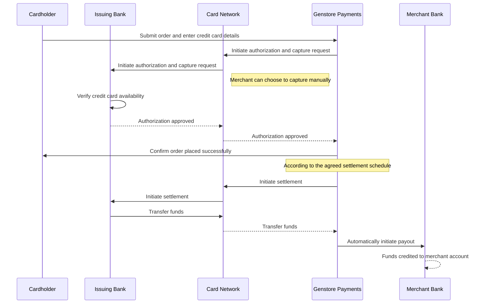

# Genstore Payments

:::tip

Currently, **Genstore Payments** is only available in a limited number of countries. Before activating **Genstore Payments**, please confirm whether the service is available in your country or region.

:::

**Genstore Payments** offers a simple online payment solution, removing the need for third-party providers or merchant accounts. Just create a **Genstore** store, and you can start accepting all major payment methods—credit cards, cash, cash on delivery, bank transfers—without any third-party transaction fees.

The general workflow is as follows:

## Topics of this chapter

- [Apply in the U.S.](./operate-genstore-payments-usa.md)
- [Apply in Hong Kong SAR](./operate-genstore-payments-hk.md)
- [Set up Genstore Payments](./operate-genstore-payments-set.md)
- [Accepted payment methods](./operate-genstore-payments-pay-options.md)
- [Payment period](./operate-genstore-payments-get-paid.md)
- [Finance](./operate-genstore-payments-finance.md)
	- [Manage payments](./operate-genstore-payments-finance-payments.md)
	- [Manage balance](./operate-genstore-payments-finance-balance.md)
	- [Manage payouts](./operate-genstore-payments-finance-payout.md)
- [Chargebacks and inquiries](./operate-genstore-payments-chargebacks-overview.md)
	- [Chargeback process and dispute handling](./operate-genstore-payments-chargebacks-process.md)
	- [Common reasons and how to respond](./operate-genstore-payments-chargebacks-reasons.md)
	- [Defense requirements](./operate-genstore-payments-chargebacks-material.md)
- [Restricted and prohibited policies](./operate-genstore-payments-restrictions.md)
