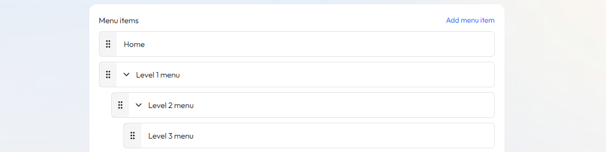

# Menus

Navigation menu is a key part of your store's user experience, linking to specific pages, products, or collections. It helps customers easily browse, find what they need, access information, and make purchases. A well-organized and efficient navigation system boosts user satisfaction, reduces bounce rates, and increases conversions.

## Default menu navigation

Every online store typically has two default menus, one at the top and one at the bottom of each page:

- **Main menu**: This is the core navigation, usually located at the top of your site, allowing users to quickly access key pages like products, categories, and brand information.
- **Footer menu**: Located at the bottom of your site, this menu includes links to customer service, store policies, social media, and more. While less visible than the main menu, it’s still important for building trust, improving the shopping experience, and boosting SEO.
- **Customer account main menu**: The customer account main menu appears at the top of the account page after login, making it easy for customers to access their account information.

| Menu type                  | Menu items                                        |
| -------------------------- | ------------------------------------------------- |
| Main menu                  | "Shop", "Products", "Contact us"                  |
| Footer menu                | "Search", "Do not sell or share my personal info" |
| Customer account main menu | "Shop home page", "Orders"                        |

## Customize navigation menu

In addition to the default menus, you can add custom menu items that link to pages like your search page, homepage, product collections, products, blog posts, policies, and more.

**Steps**

1. Log in to the Genstore admin.
2. Click **Store** -> **Online Store** -> **Menus**.
3. Click **Create menu**, then in the new window, set the menu title, URL handle, and menu items. **Menus can have up to 3 levels**, and you can rearrange menu items by dragging them.
4. After making your changes, click **Save**.

## Manage menu items

In your menu navigation list, you can:

- **Edit**: Click **Edit** next to a menu item to update it.
- **Delete**: Click **Delete** to remove a menu item. Note: Default menus (main and footer) can’t be deleted.
