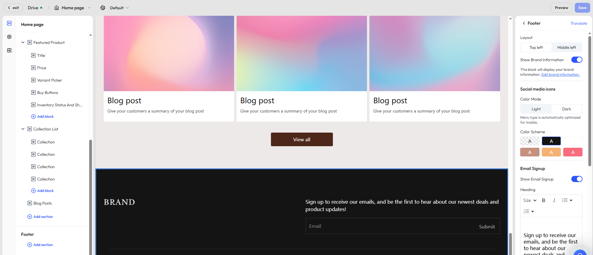

# Customize your store footer

The **footer** is a persistent section at the bottom of your site, typically displayed across all pages. It serves multiple purposes—reinforcing your brand, guiding users to take action, and ensuring compliance with legal and policy requirements. A well-designed footer plays an important role in building trust and improving SEO performance.

Effective footer settings can help:

- Strengthen brand trust and professionalism
- Encourage additional clicks or newsletter sign-ups
- Fulfill legal obligations like privacy policies and return terms

## How to access

The footer is a global section that can be configured and previewed from any page in the theme editor. To edit the footer, follow these steps:

1. Log in to your Genstore admin.
2. Go to **Store** -> **Online Store** -> **Themes**.
3. Find your target theme and click **Customize** to open the theme editor.
4. In the top toolbar, use the page selector to choose any page type (e.g., homepage, product page, collection page).
5. In the left-hand panel, you will find the configuration panel under **Footer**.

## General settings

The footer supports a flexible combination of content modules. You can enable or adjust them based on your brand identity and business needs.

|Setting category|Description|
|---|---|
|Layout|Choose how content is aligned: left or center|
|Brand display|Show your store logo or site name with a link to the homepage|
|Social media icons|Display linked icons for platforms like Facebook and Instagram|
|Email signup form|Enable an email field to collect user emails for marketing|
|Country/language selector|Allow users to switch region or language (for multi-market or multilingual stores)|
|Payment method icons|Show accepted payment logos to boost credibility|
|Policy links|Add links to legal pages like Privacy Policy and Return Policy (recommended to link to standalone pages)|
|Padding and spacing|Adjust vertical spacing above and below the footer: none / small / medium / large|
## Additional content blocks

In addition to the brand and email subscription, you can add more sections to enhance your footer’s depth and messaging.

|Block name|Description|
|---|---|
|Menu|Display a set of custom links (e.g., About Us, Support) to provide quick access to key pages|
|Text|Add descriptions like brand intro, contact info, or business hours. Supports rich text formatting|
|Image|Show brand logos, certification badges, or partner logos to boost recognition and trust|
|Video|Embed brand videos, product demos, or promotional clips in the footer|
