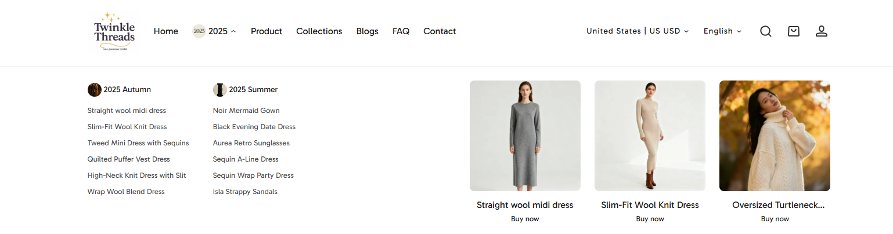
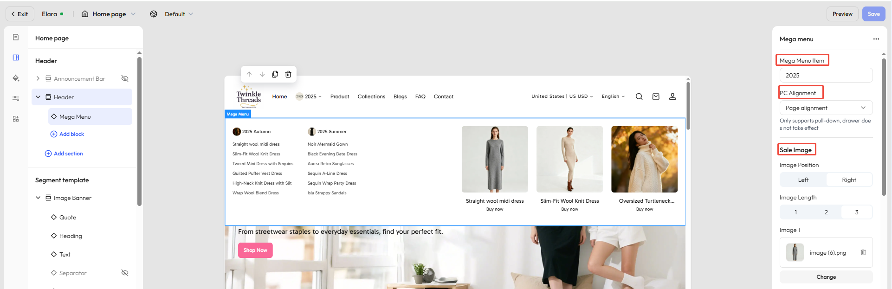

# Mega menu

Genstore supports **mega menus** in your store navigation. A mega menu helps you present complex product categories in a clear hierarchy, while also letting you add promotional or featured content directly in the navigation. By combining **navigation** and **marketing** in the store header, it makes browsing easier and boosts conversions.

## Structure and display

A mega menu is made up of **multi-level navigation** and **promotional content**:

- **Navigation menu**: Supports up to three levels (e.g., _Men → Outerwear → Down Jackets_).
- **Promotional content**: Add banners, featured collections, or products directly inside the menu.

## Step 1: Create a multi-level menu

To use a mega menu, you first need to create a **multi-level menu**.

- **Default behavior**: Multi-level menus are displayed as dropdown lists.
- **With mega menu**: You can later link them with a mega menu block in the theme editor to enhance the design and add promotional content.

Genstore supports three levels of navigation. By creating **second-level** and **third-level** menu items, you can group products, collections, or pages to help customers quickly find what they need:

- Level 1 → Top navigation entry
- Level 2 → Main columns of the mega menu
- Level 3 → Sub-lists within each column

### Steps

1. In Genstore admin, go to **Store** -> **Online Store** -> **Menus**, and click the pencil icon next to **Main menu**.
2. Click the **+** button next to the target menu item.
3. In the pop-up, enter the menu name, URL (destination page), and optionally add an image.
4. Click **Save**.
5. The new menu item will appear under the parent menu as a second-level item.
6. Repeat steps 2–4 to continue creating drop-down menus.
7. Click **Save** to complete setup.

## Step 2: Enable a mega menu in the theme editor

Once your multi-level menu is ready, you can link it with a **mega menu block** in the theme editor and customize its layout and promotional groups.

### Steps

1. In Genstore admin, go to **Store** -> **Online Store** -> **Themes**, and click **Customize** on your target theme.
2. Under **Header -> Header**, click **Add block** and select **Mega menu**.
3. Click the mega menu to select it. In the right-hand editor panel
   - Enter the name under **Mega Menu Item** to link. **Note:** The text must exactly match the navigation menu name. Extra spaces, case differences, or symbols will prevent the link from working.
    - **PC alignment**: Align to page / Justify / Adapt.
    - **Promotional groups**: Add up to **3 groups**, each with images, heading, button, and link.

### Promotional group settings

| Setting               | Description                                        |
| --------------------- | -------------------------------------------------- |
| **Image position**    | Display image on the left or right                 |
| **Image count**       | 1–3 images per group                               |
| **Heading**           | Title text for the promotion                       |
| **Button text**       | Custom label for the call-to-action                |
| **Button link**       | Destination link when clicked                      |
| **Layout**            | Text outside the image / Text overlay on the image |
| **Content alignment** | Left / Center / Right                              |
| **Aspect ratio**      | 1:1, 3:4, 4:3, or adapt (use original ratio)        |
| **Shape**             | Standard / Square / Rounded / Capsule / Arch       |