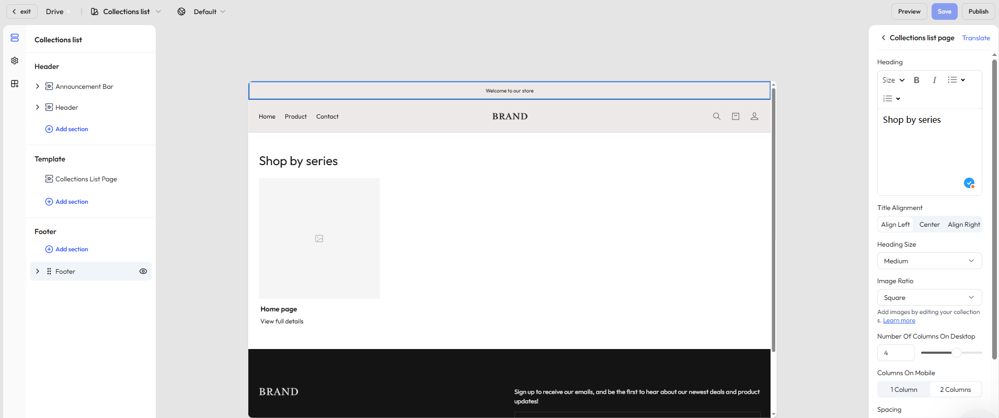

# Customize your product collection list page

The **collection list page** displays a group of product collections in a consistent grid layout. It’s often used for category navigation or themed campaigns. By showcasing each collection’s cover image and title, this page helps users easily browse different product groups, improving content organization and navigation clarity.

## Step 1: Select the page

In the editor’s top navigation bar, click the dropdown next to the current page name to open the page type selector.

- Select **Collection list** to open the default template.

## Step 2: View and edit the page structure

In the left-hand panel, you’ll see the structure of the current page. By default, it includes:

- [**Header**](./operate-store-design-themes-edit-guide-header.md): Contains the announcement bar, top navigation, and logo.
- [**Footer**](./operate-store-design-themes-edit-guide-footer.md): The bottom section, usually including newsletter signup, copyright info, and policy links.
- **Segment template**:
    - **Collection list section** – Controls the layout and content arrangement of the collection tiles
## Step 3: Customize the collection list section

Click the **Collection list section** to access its settings in the right-hand panel, where you can configure how collections are displayed.

### General settings

|Category|Description|
|---|---|
|**Title settings**|Set the page title, text alignment (left / center / right), and font size (small / medium / large)|
|**Image ratio**|Choose how collection cover images are displayed: auto-fit, portrait, or square|
|**Grid layout**|Define how many collection tiles appear per row on desktop|
|**Spacing**|Adjust spacing between cards (small / medium / large) to improve visual rhythm and readability|
|**Color scheme**|Choose light or dark mode, and apply a color theme (solid, gradient, or custom colors)|
|**Section padding**|Control vertical spacing above and below the module (none / small / medium / large / extra large)|

## Step 4: Add additional sections

Click **Add section** under the **Segment template** area to expand the page with more content. Available options include:

|Section type|Description|
|---|---|
|Image banner|Display large visuals for branding or promotions|
|Video|Embed a brand story or product intro video|
|Contact form|Let visitors send questions or feedback|
|Rich text|Share brand messaging or collection descriptions|
|Email signup|Collect subscriber emails directly on the page|
|Featured products|Promote additional key products|
|Divider|Add visual separation between sections|
|Multicolumn layout|Display content in a horizontal layout with images and text|
|Blog posts|Embed blog content for SEO and brand storytelling|
|Image with text|Combine images with call-to-action text to guide user behavior|

::: tip

Available sections may vary based on your theme. We regularly update content components based on user feedback. Always refer to what’s available in the editor for the most accurate options.  

:::
