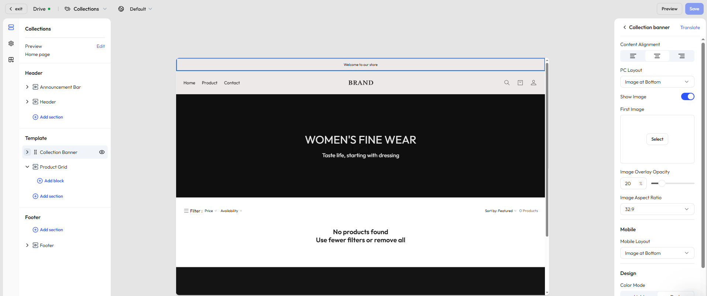

# Customize your product collection page

The **collection page** displays a group of related products—ideal for category browsing, seasonal campaigns, or curated themes. By customizing the layout and style, you can tailor the shopping experience for each collection and improve product discovery and user engagement.

## Step 1: Select a page

In the editor’s top navigation bar, click the dropdown next to the current page name to open the page type selector.

- Choose **Collection -> Default collections** to open the default template.

## Step 2: Choose a specific collection to preview

- Once you’ve selected a template, the system will load and display a live preview.
- To see how the page looks with real content, click **Edit** under the template name in the top-left corner and select a published collection.
## Step 3: View and edit the page structure

In the left-hand panel, you'll see the structure of the current page. By default, it includes:

- [**Header**](./operate-store-design-themes-edit-guide-header.md): Includes announcement bar, navigation, and logo.
- [**Footer**](./operate-store-design-themes-edit-guide-footer.md): Includes newsletter signup, copyright info, and policy links.
- **Segment template**: The main content area of the collection page. Depending on the template style, this area may include:
    - **Collection banner** – Displays the collection theme image and introductory text.
    - **Product grid** – Shows all products in the collection, with customizable layout and filtering.

## Step 4: Edit the collection banner

Use the banner section to highlight the collection theme with visuals and messaging. You can customize the image layout, overlays, and text display to support brand storytelling and campaign goals.

### General settings

|Setting|Description|
|---|---|
|Content alignment|Align text left / center / right|
|Image-text layout|Choose from 3 desktop styles (image left, image right, image background); mobile layout is configured separately|
|Image settings|Upload a main image, adjust image display, layer opacity, and aspect ratio|
|Color scheme|Switch between light and dark modes, with support for solid or gradient backgrounds|
|Section padding|Set top and bottom spacing (none / small / medium / large / extra large)|

### Configurable blocks

- **Title** – Add a collection headline with style controls
- **Description** – Add a brief description to introduce the collection; font size and color are customizable

## Step 5: Edit the product grid

This section displays all products in the selected collection. You can control layout, sorting, and filter options to enhance the shopping experience.

### General settings

The product grid allows layout customization, filtering settings, and control over what appears on product cards. It’s commonly used on category and promotion pages.

| Function group      | Example settings                                                                                                                          |
| ------------------- | ----------------------------------------------------------------------------------------------------------------------------------------- |
| Layout              | Products per page, columns, color scheme                                                                                                  |
| Mobile optimization | Number of columns on mobile                                                                                                               |
| Product card info   | Show vendor, price, quick add button, hover image (2nd/3rd images)                                                                        |
| Filtering & sorting | Enable filters (integrated with [Search & Discovery app](./operate-store-design-search-discovery.md)), set sort options and filter layout |
| Section padding     | Configure top/bottom spacing to improve flow and structure                                                                                |

### Addable blocks

- **Title** – Optional headline for the collection page
- **Description** – Additional text to explain collection features
- **Apps** – In the **Add block** pop up, you can add dynamic modules like related products, bestsellers, and more in the **Apps** tab

## Step 6: Add more sections

In the **Segment template** area, click **Add section** to enrich your collection page with additional content modules:

|Section type|Description|
|---|---|
|Image banner|Highlight brand visuals or promos|
|Video|Embed a brand story or product overview|
|Contact form|Let users leave inquiries or feedback|
|Rich text|Add brand messaging or informative content|
|Email signup|Collect email addresses from visitors|
|Featured products|Recommend other key products|
|Divider|Visually separate sections|
|Multicolumn layout|Build side-by-side layouts with custom text and images|
|Blog posts|Embed blog articles to boost content engagement|
|Image with text|Combine imagery and CTA messaging in one module|

::: tip

Available sections may vary based on your theme. We regularly update content components based on user feedback. Always refer to what’s available in the editor for the most accurate options. 

:::
