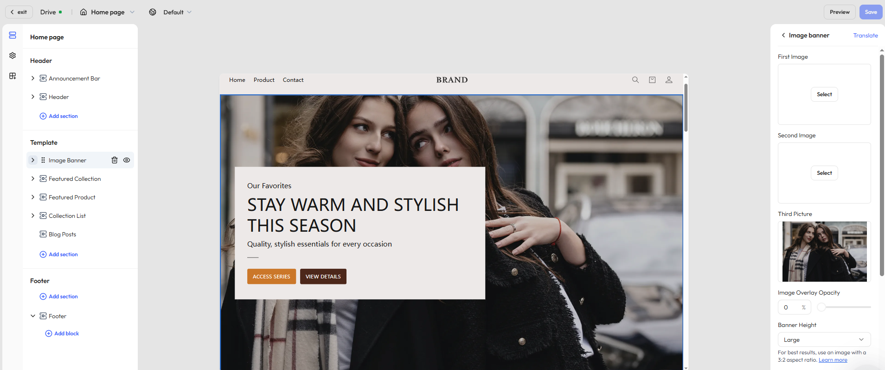

# Customize your store homepage

The **home page** is the heart of your storefront—it's where you capture attention, communicate your brand’s value, and drive conversions. A well-structured, content-rich homepage helps establish brand recognition and guides visitors deeper into your site, increasing the likelihood of purchases.

With Genstore’s theme editor, you can freely arrange modular sections and customize your homepage’s layout and style to create a visually impactful and conversion-driven experience.

## How to access

To edit your homepage, follow these steps:

1. Log in to your Genstore admin.
2. Go to **Store** -> **Online Store** -> **Themes**.
3. Find your target theme and click **Customize** to open the theme editor.
4. By default, the system opens the homepage for editing.

## Default sections

The editor provides several built-in sections that you can customize or reorder based on your business needs:

| Section name        | Description                                                                                                            |
| ------------------- | ---------------------------------------------------------------------------------------------------------------------- |
| Image banner        | Highlights your brand’s hero visual, promotional message, or key campaigns—commonly placed at the top of the homepage. |
| Featured collection | Showcase curated product collections with custom images, titles, and call-to-action buttons.                           |
| Featured product    | Highlight specific products, ideal for new arrivals, flash sales, or bestsellers.                                      |
| Collection list     | Displays a grid of all product collections with thumbnails that link to individual collection pages.                   |
| Blog posts          | Embed blog content to support content marketing, improve SEO, and build brand loyalty.                                 |

## Additional sections

Click **Add section** to enrich your homepage with more advanced and expressive content blocks:

| Section name    | Description                                                                                       |
| --------------- | ------------------------------------------------------------------------------------------------- |
| Video           | Embed brand stories, product explainers, or promo clips to enhance visual engagement.             |
| Slideshow       | Rotate multiple images and text to highlight campaigns, promotions, or important links.           |
| Contact form    | Allow customers to leave inquiries or feedback—boosting interaction and trust.                    |
| Rich text       | Share brand values, shopping guides, or informative content in a styled text format.              |
| Email signup    | Add a newsletter subscription form to grow your customer email list.                              |
| FAQ             | Address common questions to reduce support workload and build user confidence.                    |
| Collage         | Mix images and text in a flexible layout to showcase products, categories, or visuals.            |
| Divider line    | Visually separate sections to improve flow and readability.                                       |
| Image with text | Pair images and messaging—ideal for introducing your brand or driving action with CTAs.           |
| Multicolumn     | Display multiple image-text combinations side by side to promote products, services, or features. |
| Scrolling text  | A horizontal ticker to display slogans, promo notices, or announcements in an eye-catching way.   |

Each section includes default configuration options—allowing you to adjust styles, text, and layout. For more detailed customization, you can also click **Add block** within each section to insert additional content elements or variations.

::: tip

Available sections may vary based on your theme. We regularly update content components based on user feedback. Always refer to what’s available in the editor for the most accurate options.  

:::