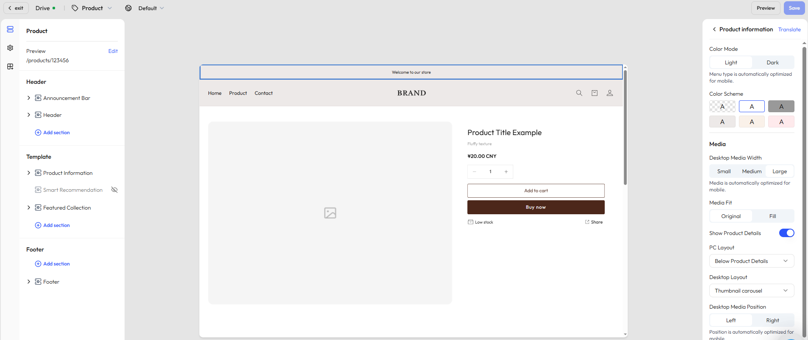

# Customize your product page

The **product detail page** is critical for driving conversions. It presents product information, purchase options, and related recommendations. This guide helps you understand the page structure, editing steps, and customization options.

  

## Step 1: Select a page

In the editor’s top navigation bar, click the dropdown next to **Home page**  to expand the list of supported page types for the current market.
- Select **Product → Default product** to access the default product detail theme.

## Step 2: Choose a specific product for preview

- Once a theme is selected, the system will automatically load and display a preview.
- To see how it looks with actual content, click **Edit** under the theme name in the top-left corner and select a published product.

## Step 3: View and edit the page structure

In the left-hand panel, you’ll find the structural layout of the page. By default, it includes the following:

- [**Header**](./operate-store-design-themes-edit-guide-header.md): Includes the announcement bar, top navigation menu, etc.
- [**Footer**](./operate-store-design-themes-edit-guide-footer.md): The bottom area, typically showing newsletter signup, copyright, and policy links.
- **Template**: This section contains the core content of the product page and may include the following modules, depending on the chosen layout:
    - **Product information**: Includes the product title, vendor/shipping info, price, tags, inventory, and a [Buy Button](./operate-payments-accelerated-checkouts.md). You can freely combine content blocks to create a personalized layout.
    - **Smart recommendations**: Automatically recommends related products based on user behavior and product attributes.
    - **Featured collections**: Showcases curated sets of related products.

### Price settings

In the **Price** block of the **Product Information** section, you can configure global settings in the theme editor:  

- **Show compare-at price**: Choose whether to display the original price for comparison.  
- **Price text size**: Select from small / medium / large / extra-large to fit different visual needs.  
- **Price style enhancement**: Enable bold text to highlight the sale price and improve conversions.  
- **Show taxes**: Choose whether to display tax information.  
- **Product badges**: Enable or disable badges, with customizable styles for marketing.
- **Discount labels**: Choose between *Sale* or *Save* styles, with options to display by discount percentage or discount amount.  

#### Badge display  

In addition to the setting entrance in the **Price** block of the **Product Information** section, you can also configure badges in the Style design panel (third icon from the top on the left function navigation bar), then locate the **Badge** section under the **Product cards** section:  

- **Toggle control**: Enable or disable badge display.  
- **Badge position**: Place badges at the top left, top right, bottom left, or bottom right for flexible design.  
- **Badge styles**: Choose from multiple style options (e.g., Style 1, Style 2) to fit different visual needs.  
- **Discount label types**: Select *Sale* or *Save* labels.  
- **Discount label display**: Choose whether to show the discount percentage or the discount amount.  
- **Badge color schemes**: Apply theme color, main color, accent, or auxiliary colors to match your brand identity.  

### Display tags

Display tags are used to highlight a product’s key features and selling points. They are shown above the product title by default and can be repositioned by dragging.

### Sticky cart (mobile)

The Sticky Cart (mobile) is a quick purchase bar that stays fixed at the bottom of the product page while customers browse product details. Even when scrolling down the page, customers can add items to the cart or buy instantly, helping reduce friction and improve conversion.

This feature is enabled by default and requires no additional setup. It appears at the bottom of the template and can be repositioned by dragging.

When enabled:

- For products with multiple variants, clicking **Add to cart** or **Buy now** in the sticky bar automatically opens the variant selection modal.
- The modal displays key information, including variant images (thumbnails), product name, selected options (such as color or size), and price. After confirming the selection, customers can proceed directly to add the item to the cart or place an order.

## Step 4: Add more sections and apps

Beyond the default layout, you can enrich the product detail page by adding custom sections such as visuals, text, or branded media.

### Add a section

Under the **Segment template** area, click **Add section** to choose from the following modules:

|Section type|Description|
|---|---|
|Image banner|Highlight promotional visuals or brand identity|
|Video|Embed brand stories or product overviews|
|Contact form|Let customers submit inquiries or feedback|
|Rich text|Add branded messaging or product-related content|
|Email signup|Collect emails for newsletters and offers|
|Featured products|Recommend other key products|
|Divider|Visually separate modules|
|Multicolumn layout|Create horizontal layouts with custom text and images|
|Blog posts|Embed content marketing articles|
|Image with text|Combine image and CTA text in one block|

::: tip

Available sections may vary based on your theme. We regularly update content components based on user feedback. Always refer to what’s available in the editor for the most accurate options. 

:::

### Add apps

When you click **Add block** or **Add section**, you’ll see an **Apps** tab in the popup window. From there, you can insert functional app modules to enhance product discovery and conversion. Available options include:

- Related products
- Bestsellers
- You may also like
- Trending now

## Step 5: Customize content and styles

Once the page structure is set, you can configure each secttion and block to better reflect your brand and meet customer needs. Click any section or block to open the right-hand settings panel where you can:

- Customize text content, layout style, and order
- Adjust brand colors, visibility conditions, and image display options

You can also click **Add block** within each section to further enrich the content. Example blocks include:

- **Divider**: For clearer visual separation
- **Collapsible row**: Ideal for FAQs, product warnings, or return policies
- **Vendor info**: Reinforce product credibility with supplier details