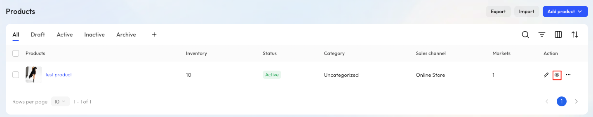
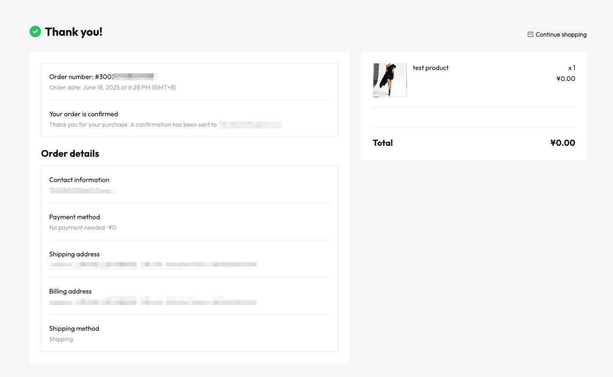
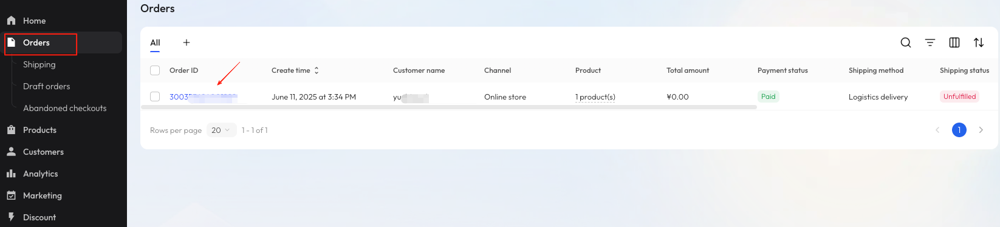

# Create a test order

Before launching your store, you can create a test order to ensure key steps like product display, checkout, shipping details, payment, and order creation are working as expected.

::: tip

We recommend adding a note like “Test Order” to help identify and manage it later.

:::

## Step 1: Publish a $0 test product

To test the checkout process, start by creating a simple product with a $0 price and make it available for sale.

### Operation steps：

1. Log in to your Genstore admin, click **Store** -> **Products**.
2. Click **Add product** in the top-right corner and select a product type (e.g., **Physical product**).
3. Fill in the basic details:
    - **Product title**: e.g., “Test Product”
    - **Upload image**: Add any sample image
    - **Price**: Leave it at `0`
4. Make sure the product status is set to **Active**.
5. Click **Save**.

For more on product setup, see [Products](./operate-product.md).

## Step 2: Preview the test product

Even if your storefront isn’t fully set up, you can preview the product using the default theme and test the full checkout flow.

Go back to the product list and click the **Preview** icon to see how it appears to customers.

## Step 3: Test the customer checkout flow

On the preview page, click **Buy now** to start the checkout process. Enter test buyer information as prompted, including email, name, and shipping address.

After filling in the form, click **Pay now** to place the order. You’ll be taken to the order confirmation page, where you can view the order ID, contact info, shipping method, billing address, ZIP code, and more.

## Step 4: View the test order

Go back to the Genstore admin and click **Store -> Orders** from the left-hand menu. You’ll see the test order listed. Click the order ID to view its details.

To help identify it, click the **Note** icon and add a label like “Test Order.”

You can also test actions like shipping, returns, refunds, and exchanges to verify your order workflows. For more details, see [Manage orders](./operate-orders.md).
