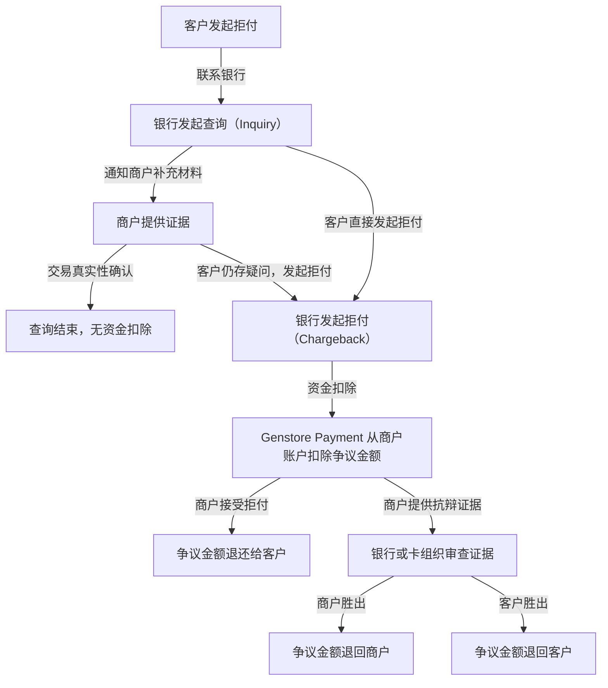

# 拒付和查询

当您的商店支持信用卡付款时，有时客户可能会对某笔交易提出异议，例如他们不记得这笔消费、对产品或服务不满意，或者怀疑这是一笔欺诈交易。这时，您可能会遇到拒付（**Chargeback**）或则查询（**Inquiry**）情况：

* **拒付** 是指买家（持卡人）对某笔已完成的交易存在争议，并直接向发卡银行申请撤销付款，导致资金从您的账户被扣回。拒付通常涉及交易真实性、产品质量或服务体验的争议。
* **查询** 是指发卡行或者卡组通过支付网关或者银行系统，查询特定交易的详细信息的情况。查询通常用来确保交易的真实性和有效性，从而确保交易安全和减少欺诈风险。

## 拒付流程

交易完成后，持卡人如对交易有疑问，通常会先联系银行提出争议。银行可能通过信用卡网络发起**查询**流程，要求商户提供交易的补充材料以确认真实性。此阶段不会立即扣款。

如果持卡人进一步发起**拒付**，Genstore Payment 收到拒付通知后，将立即从您的账户余额或待结算金额中扣除争议款项以及拒付产生的相关费用。

商户收到拒付请求后，可选择接受拒付结果或提供相关证据启动抗辩流程。如果您在抗辩过程中胜出，争议金额将退回您的账户。如果持卡人胜出，争议金额则退还给持卡人。拒付相关费用的退还政策因国家/地区而异。

以下流程图展示了拒付和查询的基本处理流程：

## 拒付与退款的区别

经常与拒付一起出现的概念是退款。两者的对比差异如下。

| **对比维度**   | **拒付（Chargeback）**                  | **退款（Refund）**                 |
| ---------- | ----------------------------------- | ------------------------------ |
| **发起方**    | **买家（持卡人）** 直接通过发卡行或卡组织（如 Visa、银联）发起 | **商户**主动发起（如协商一致后退款）           |
| **流程路径**   | 买家 → 发卡行 → 卡组织 → 商户                 | 买家 → 商户 → Genstore （无需银行和卡组介入） |
| **资金处理**   | 强制从商户账户扣除资金，可能产生额外费用                | 商户主动通过支付渠道退款，无额外费用             |
| **争议解决方**  | **银行或卡组织**裁定责任，商户需提交证据抗辩            | **商户与买家协商**解决（如退货、补偿）          |
| **处理时效**   | 流程复杂，通常需 30-90 天出结果                 | 流程简单，最快即时到账（取决于支付渠道）           |
| **商户控制权**  | 被动应对，需在规定时间内（如 7 天）提交证据             | 商户主动掌控退款金额和流程                  |
| **费用与成本**  | 可能有额外拒付手续费（由卡组织收取），而退还政策取决于卡组相关规则安排 | 仅有渠道手续费                        |
| **对账户的影响** | 高拒付率可能导致**账户冻结、交易权限受限**，以及其他限制措施。   | 合理退款不会影响账户状态，但频繁退款可能影响店铺信誉     |
| **典型场景**   | 未收到产品、盗刷、欺诈交易，或未经商户沟通的质量投诉          | 产品瑕疵、发货延迟、买家主动取消订单等双方认可的情形     |
