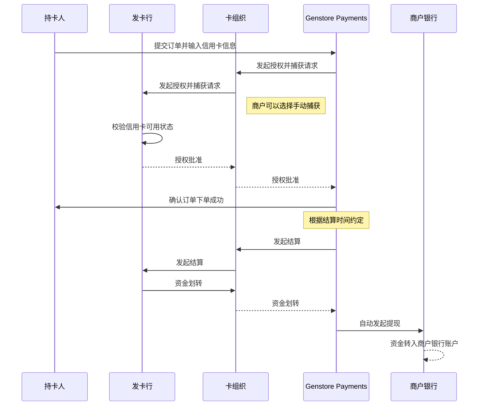

# Genstore Payments

:::tip

目前 **Genstore Payments** 仅在少数国家开通，开通 Genstore Payments 前，请确认您所在国家或地区是否支持该服务。

:::

**Genstore Payments** 是最简单的在线支付解决方案，免去了设置第三方支付服务商或商家账户的繁琐步骤。当您的 Genstore payments 申请通过后，即可自动接受所有主要支付方式，同时无需支付任何第三方交易费，无论是信用卡支付还是手动支付方式（如现金、货到付款、银行转账等）。

当商户通过 Genstore Payments 收款时，业务流程如下：

## 本节目录

- [美国商户申请指南](./operate-genstore-payments-usa.md)
- [香港特别行政区商户申请指南](./operate-genstore-payments-hk.md)
- [设置 Genstore Payments](./operate-genstore-payments-set.md)
- [接收的支付方式](./operate-genstore-payments-pay-options.md)
- [付款期](./operate-genstore-payments-get-paid.md)
- [财务](./operate-genstore-payments-finance.md)
  - [管理支付](./operate-genstore-payments-finance-payments.md)
  - [管理余额](./operate-genstore-payments-finance-balance.md)
  - [管理付款](./operate-genstore-payments-finance-payout.md)
- [拒付](./operate-genstore-payments-chargebacks-overview.md)
	- [拒付流程和纠纷处理](./operate-genstore-payments-chargebacks-process.md)
	- [常见拒付原因和处理方式](./operate-genstore-payments-chargebacks-reasons.md)
	- [抗辩材料要求](./operate-genstore-payments-chargebacks-material.md)
- [禁止与受限条款](./operate-genstore-payments-restrictions.md)
