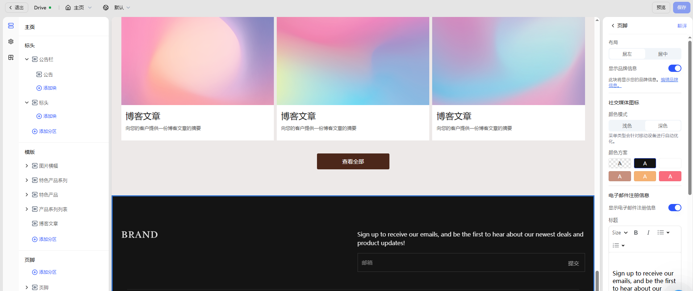

# 页脚编辑指南

页脚（Footer） 是页面底部的常驻信息区域，通常在所有页面中保持一致显示。它承担着品牌强化、用户引导与合规展示等多重功能，是提升站点可信度与 SEO 表现的重要组成部分。

良好的页脚设置可以：

- 增强品牌信任感与专业形象
- 引导用户完成二次点击或留资操作
- 满足隐私政策、退换条款等合规性要求

## 如何访问

页脚为通用区域，在任一页面中均可进行配置与预览。若要编辑页脚区域，请按照以下步骤进入编辑器：

1. 登录 Genstore 商家后台。
2. 进入 **商店** -> **在线商店** -> **模版**。
3. 找到目标模版，点击右侧的 **设计** 按钮，进入模版编辑器。
4. 在顶部导航栏点击页面选择器，选择任一页面类型（如主页、产品页、系列页）。
5. 在左侧操作面板中，您将在 **页脚** 分区下找到相关配置区域。
   
## 通用配置项

页脚支持多种内容模块的灵活组合，您可根据品牌定位与业务需求自由启用或调整。

|配置类别|说明|
|---|---|
|布局|设置内容整体的对齐方式：居左 / 居中|
|品牌信息展示|显示店铺 Logo 或站点名称，支持点击跳转首页|
|社交媒体图标|展示绑定的社交平台图标（如 Facebook、Instagram）|
|邮件订阅表单|开启后展示邮箱输入框，用于收集用户邮件（营销推广）|
|国家 / 语言选择器|显示语言或地区切换器（适用于多语言或多市场站点）|
|付款方式图标|展示支持的支付方式图标，增强信任感|
|政策链接|添加隐私政策、退换条款等合规链接（建议链接至独立页面）|
|区块填充与间距|控制页脚上下留白，选项包括无 / 小 / 中 / 大|

## 可拓展区块

除了基本品牌信息与订阅入口外，您还可以添加多个分区模块来丰富页脚内容，提高信息密度与品牌表达力。

|区块名称|说明|
|---|---|
|菜单|展示一组自定义导航链接（如关于我们、售后服务），用于构建页脚快捷入口。|
|文本|补充品牌介绍、联系方式、营业时间等说明性内容，支持富文本格式。|
|图片|展示品牌 Logo、认证图章或合作方图标，增强品牌识别与信任感。|
|视频|可用于在页脚中嵌入品牌宣传片、产品展示动画或活动短片。|