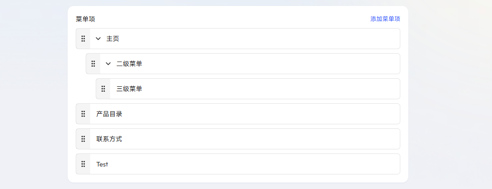
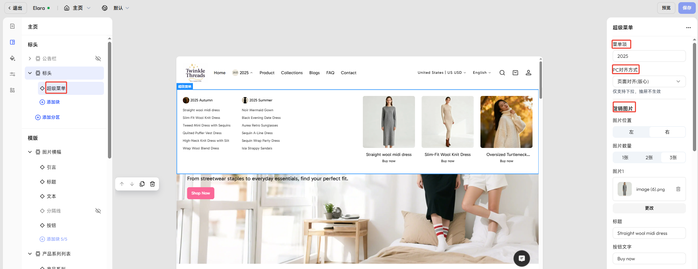

# 超级菜单

Genstore 支持在店铺导航中使用 **超级菜单**。**超级菜单** 可以帮助您将复杂的产品分类通过层级结构清晰呈现，并在导航中直接加入促销或推荐内容。通过将 **导航功能** 与 **营销内容** 结合在一起，使店铺的页头既便于浏览，又能促进转化。

## 店铺前台呈现效果

超级菜单由 **多层级导航** 与 **促销内容** 组合而成：

- **导航菜单**：支持最多三级（如 _男装 → 外套 → 羽绒服_）。
- **促销内容**：可在菜单中直接嵌入横幅、推荐集合或产品。
    

## 步骤一：创建多层级菜单

要使用超级菜单，您需要先创建一个 **多层级菜单**。

- **默认表现**：多层级菜单会以下拉列表的形式展示子菜单。
- **升级为超级菜单**：您可以在装修编辑器中将其与超级菜单区块绑定，实现更丰富的视觉效果，同时添加促销位。

Genstore 支持三级菜单，您可通过创建 **二级菜单**、**三级菜单** 可以将产品、系列或页面分组，帮助顾客更快找到需要的内容：

- 一级菜单 → 顶部导航入口
- 二级菜单 → 超级菜单主要分栏
- 三级菜单 → 分栏下的子列表

### 操作步骤

1. 在 Genstore 后台进入 **商店** -> **在线商店** -> **菜单**，点击 **主菜单** 后的铅笔图标。
2. 点击 目标菜单项后的 **+** 按钮。
3. 在弹窗中，输入菜单名称、url （菜单指向的页面）以及是否为菜单增加图片展示（可选）。
4. 点击 **保存**。
5. 新创建的菜单将自动出现在将该菜单项的下方，成为它的二级菜单。
6. 您可重复步骤 2、3、4，继续创建下拉菜单。
7. 点击 **保存** 完成设置。

## 步骤二：在装修编辑器中启用超级菜单

完成多层级菜单创建后，您可以在装修编辑器中将其与 **超级菜单** 关联，并自定义布局样式和促销内容组。

### 操作步骤
1. 在 Genstore 后台进入 **商店** -> **在线商店** -> **模版**，点击目标主题后的 **设计** 按钮。
2. 在 **标头** -> **标头** 部分，点击 **添加块**，在弹窗中选择 **超级菜单**。
3. 选中 **超级菜单** 后，在右侧面板可设置：
	- 输入待关联的顶级菜单名称。**注意**：文本必须完全匹配导航菜单的名称，避免因多空格、大小写或符号差异导致无法关联。
	- **PC 对齐方式**：与页面对齐 / 两端对齐 / 适应内容。
	- **促销内容组**：最多支持 **3 组**，每组包含图片、标题、按钮和链接等。

### 促销内容组配置项

| 设置       | 描述                        |
| -------- | ------------------------- |
| **图片位置** | 图片显示在左侧或右侧                |
| **图片数量** | 每组支持 1–3 张图片              |
| **标题**   | 营销内容标题                    |
| **按钮文本** | 按钮显示的自定义文案                |
| **按钮链接** | 点击按钮后跳转的目标链接              |
| **布局**   | 文本在图片外 / 文本覆盖在图片上         |
| **内容对齐** | 左 / 中 / 右                 |
| **长宽比**  | 1:1, 3:4, 4:3 或自动（保持原图比例） |
| **形状**   | 标准 / 方形 / 圆角 / 胶囊 / 拱形    |
