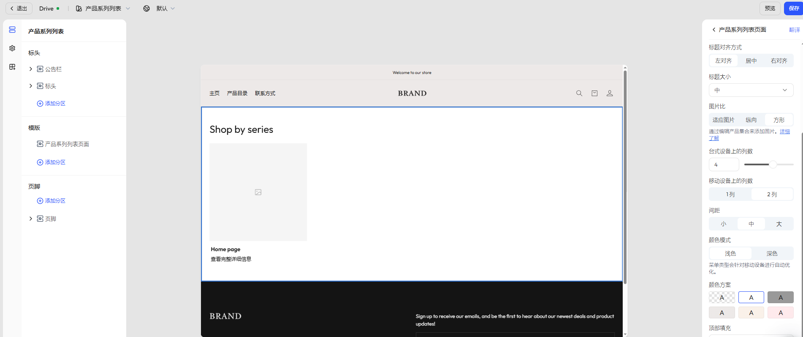

# 产品系列列表

产品系列页是用于展示某一类产品集合的页面，常用于分类浏览、主题活动等场景。通过统一网格样式展示系列封面图与标题，引导用户点击进入具体系列页面浏览产品，提升内容组织效率与页面引导性。

## 步骤一：选择页面

在编辑器顶部导航栏，点击当前页面名右侧下拉箭头，展开页面类型选择器。

- 选择 **产品系列列表**，进入默认模版。

## 步骤二：查看并编辑页面结构

在左侧操作面板中，可查看当前页面的模块结构，默认包含以下内容：
- [标头](./operate-store-design-themes-edit-guide-header.md)：公告栏、顶部菜单等。
- [页脚](./operate-store-design-themes-edit-guide-footer.md)：底部区域，通常包含订阅、版权、政策链接等内容。
- **模版**：
	- **产品系列列表页面**：可设置系列展示样式与内容排布

## 步骤三：编辑产品系列列表页面

点击 **产品系列列表页面** 分区，可在右侧面板中配置页面展示样式。

### 通用配置项

|类别|配置项说明|
|---|---|
|**标题设置**|设置页面标题内容、对齐方式（左/中/右）及字号（小/中/大）|
|**图片比例**|支持适应图片、纵向图或方形图，适配不同风格的系列封面图|
|**网格布局**|自定义桌面端每行展示列数|
|**间距控制**|设置系列卡片之间的间距（小/中/大），增强页面节奏感与可读性|
|**颜色样式**|选择浅色/深色模式及颜色方案（纯色/渐变/主题色）|
|**区块填充**|控制模块上下边距（无/小/中/大/特大），加强分区清晰度|

## 步骤四：添加分区

在 **模版** 区域点击 **添加分区**，可继续拓展内容区域，例如：

|分区类型|说明|
|---|---|
|图片横幅|展示品牌大图或促销视觉|
|视频|插入品牌故事或产品介绍|
|联系表|引导用户填写咨询/反馈表单|
|富文本|添加品牌理念、产品说明等文本内容|
|邮件注册|添加邮件订阅入口|
|特色产品|推荐其他重点商品|
|分隔线|用于模块之间的视觉隔断|
|多列布局|自定义图文组合排版|
|博客文章|嵌入内容营销文章|
|带文本的图片|图文组合式展示品牌信息或引导 CTA|

::: tip

为了更好满足商家多样化的页面设计需求，我们会持续根据用户反馈迭代新增分区与区块组件。因此，页面中实际可用的内容组件可能会与本帮助文档略有出入，建议以编辑器中的实际内容为准。此外，不同主题模版可能会展示不同的区块样式和功能，敬请留意。

:::
