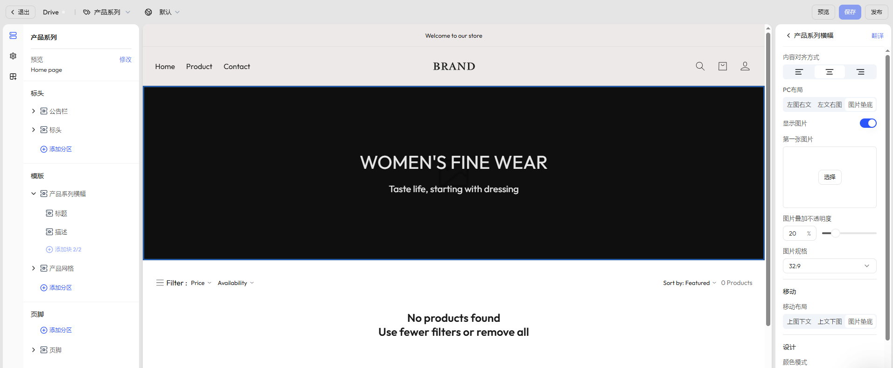

# 产品系列

产品系列页是用于展示某一类产品集合的页面，常用于分类浏览、主题活动等场景。通过灵活配置页面结构与样式，您可为不同系列构建独立风格的展示体验，提升用户的浏览效率与选购意愿。

## 步骤一：选择页面

在编辑器顶部导航栏，点击当前页面名右侧下拉箭头，展开页面类型选择器。

- 选择 **产品系列** -> **默认产品系列**，进入默认模版。

## 步骤二：选择具体产品进行预览

- 选择页面模版后，系统将自动加载当前模版并展示预览效果。
- 如需查看真实展示效果，可点击左上角模版名称下的 **修改**，从已发布产品系列中选择具体产品系列进行预览。

## 步骤三：查看并编辑页面结构

在左侧操作面板中，可查看当前页面的模块结构，默认包含以下内容：
- [标头](./operate-store-design-themes-edit-guide-header.md)：公告栏、顶部菜单等。
- [页脚](./operate-store-design-themes-edit-guide-footer.md)：底部区域，通常包含订阅、版权、政策链接等内容。
- **模版**：产品详情页的主要内容载体，根据不同模版风格，可能由以下分区组合而成：
	- **产品系列横幅**：用于展示系列主题图与引导文案。
	- **产品网格**：展示系列下所有产品，支持自定义排列与筛选逻辑

## 步骤四：编辑产品系列横幅

用于展示产品系列主题形象，可配置图文排布、图层样式与内容展示方式，适用于品牌视觉传达与活动引导。

### 通用配置项

|配置项|说明|
|---|---|
|内容对齐|设置文字在模块中的横向对齐方式（左 / 居中 / 右）|
|图文布局|PC 端支持三种排布（左图右文 / 左文右图 / 图片垫底）；移动端可独立配置|
|图片设置|可上传首图，控制是否展示图片，支持设置图层叠加透明度与显示比例|
|颜色样式|支持浅色 / 深色模式，配合纯色、渐变背景，增强风格一致性|
|区块填充|设置模块上下边距（无 / 小 / 中 / 大 / 特大），调整视觉节奏|

### 可配置区块

- **标题**：系列主题标题，支持样式调整
- **描述**：用于补充说明系列特色，可设置字体大小与颜色

## 步骤五：编辑产品网格

用于展示该系列下的全部产品，支持多种排列与筛选展示，提升用户选购效率。

### 通用配置项

产品网格模块支持自定义展示样式、筛选方式与产品卡片内容配置，常用于分类页浏览、促销活动展示等场景。

以下为主要功能分类：

|功能分类| 配置项示例                                                                                 |
| ----- | ------------------------------------------------------------------------------------- |
|布局样式| 每页产品数、列数、颜色方案等                                                                        |
|移动端优化| 移动端列数设置                                                                               |
|产品卡信息| 显示厂商、价格、快速添加按钮、悬停展示第二/三张图                                                             |
|筛选与排序| 启用筛选（搭配 [Search & Discovery 应用](./operate-store-design-search-discovery.md)、排序方式、筛选布局 |
|分区边距| 顶部/底部填充设置，增强页面节奏与层次                                                                   |

### 可添加区块

- **标题**：系列主题标题，支持样式调整
- **描述**：用于补充说明系列特色，可设置字体大小与颜色
- **应用**：点击 **应用** 页签，可添加功能型应用模块，如：关联推荐、畅销产品等

## 步骤六：添加分区

在 **模版** 区域点击 **添加分区**，可从以下模块中选择所需内容类型：

|分区类型|说明|
|---|---|
|图片横幅|展示品牌大图或促销视觉|
|视频|插入品牌故事或产品介绍|
|联系表|引导用户填写咨询/反馈表单|
|富文本|添加品牌理念、产品说明等文本内容|
|邮件注册|添加邮件订阅入口|
|特色产品|推荐其他重点商品|
|分隔线|用于模块之间的视觉隔断|
|多列布局|自定义图文组合排版|
|博客文章|嵌入内容营销文章|
|带文本的图片|图文组合式展示品牌信息或引导 CTA|

::: tip

为了更好满足商家多样化的页面设计需求，我们会持续根据用户反馈迭代新增分区与区块组件。因此，页面中实际可用的内容组件可能会与本帮助文档略有出入，建议以编辑器中的实际内容为准。此外，不同主题模版可能会展示不同的区块样式和功能，敬请留意。

:::
