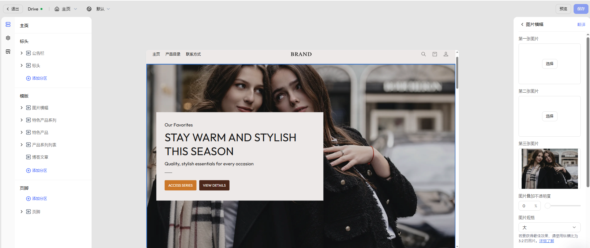

# 主页

主页（Home page）是吸引访客、传递品牌价值和推动转化的核心页面。一个结构合理、内容丰富的首页，不仅能有效建立品牌认知，也有助于引导用户浏览全站、提高下单率。

通过 Genstore 模板编辑器，您可以灵活组合模块，自定义首页结构与样式，打造具有视觉冲击力与营销导向性的页面。

## 如何访问

若要编辑主页区域，请按照以下步骤进入编辑器：

1. 登录 Genstore 商家后台。
2. 进入 **商店** -> **在线商店** -> **模版**。
3. 找到目标模版，点击右侧的 **设计** 按钮，进入模版编辑器。
4. 系统默认将打开店铺主页。

## 默认分区

编辑器默认提供多个基础分区，您可根据业务需求自由调整内容与顺序：

|分区名称|用途说明|
|---|---|
|图片横幅|展示品牌主视觉、宣传标语或重点活动，常用于首页首屏|
|特色产品系列|展示精选的产品系列，支持配置系列图、标题和跳转按钮|
|特色产品|展示重点产品，适用于新品推荐、限时促销、热销单品等|
|产品系列列表|展示所有产品系列的缩略图网格，支持跳转至系列详情页|
|博客文章|嵌入内容营销文章，增强品牌粘性与 SEO 表现|

## 可拓展分区

点击 **添加分区**，您可进一步通过以下组件丰富店铺主页：

|分区名称|用途说明|
|---|---|
|视频|插入品牌故事、产品介绍等视频内容，提升视觉表现力|
|幻灯片|支持轮播展示多张图片与引言文案，可用于突出品牌视觉、展示重点活动或引导访问重要页面|
|联系表|提供客户留言入口，增强互动与转化|
|富文本|展示品牌理念、购物指南等说明性内容|
|电子邮件注册信息|添加注册入口，收集潜在客户联系方式|
|常见问题|展示 FAQ，减少客服负担、增强用户信任|
|拼贴画|图文混排模块，展示品牌视觉、重点商品与系列入口等|
|分隔线|用于模块间的视觉划分，提升页面节奏感|
|带文本的图片|图文结合组件，适用于传递品牌理念或引导点击 CTA|
|多列|横向排列多个图文组合，用于并列展示产品、服务或要点信息|
|滚动文本|横向滚动文本条，强化促销信息、口号或提醒文案展示|

每个分区均提供默认配置项，可调整样式、文字等内容。
除默认配置项外，您还可在每个分区下点击 **添加块**，实现更丰富的内容和样式设计。

::: tip

为了更好满足商家多样化的页面设计需求，我们会持续根据用户反馈迭代新增分区与区块组件。因此，页面中实际可用的内容组件可能会与本帮助文档略有出入，建议以编辑器中的实际内容为准。此外，不同主题模版可能会展示不同的区块样式和功能，敬请留意。

:::
