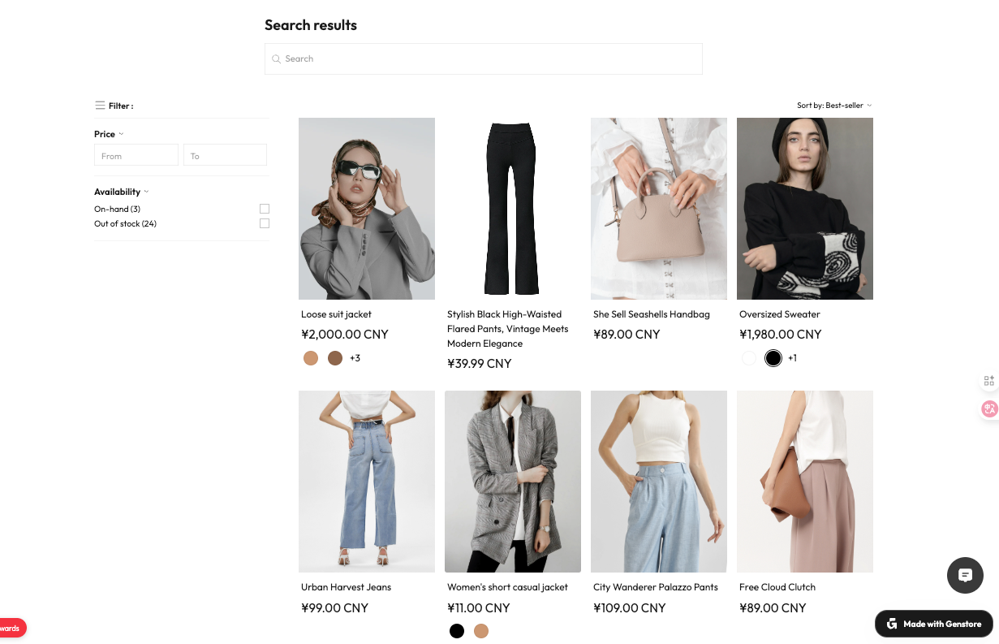

# 在产品卡上展示颜色规格

产品卡（Product card）指在产品列表、系列页或搜索结果中展示的单个产品预览单元。它通常包含产品主图、标题、价格等关键信息，并支持扩展配置（如颜色规格、标签等）。

对于多规格产品，Genstore 支持在产品卡上以色板形式展示可选规格。顾客在选中某个 SKU 后，可直接查看该颜色对应的主图，帮助快速感知差异、提升购买效率。

## 使用场景

- **浏览产品列表 / 系列页**：当顾客在产品列表或产品系列页看到一款多颜色产品时，鼠标悬浮或点击某个色板，就能立即看到该颜色款式的图片，避免跳转详情页才能看图的流程；
- **搜索结果展示**：在搜索结果中也能直观展示色板与对应图片，提升用户体验，使顾客更快定位中意颜色；
- **特色产品系列 / 专题推荐区**：在专题或推荐区展品卡时，也可显示色板，增强视觉吸引力与交互便捷性。

## 前置准备

启用色板与图片联动展示前，需确保：

- 产品为 **多规格**；
- 其中一个规格为 “颜色 / Color”。

## 操作步骤

1. 登录 Genstore 商户后台，点击 **商店** -> **在线商店** -> **模版**。
2. 点击当前主题后的 **设计** 按钮。
3. 在最左侧的功能导航栏中，点击 **样式设计** 图标 （竖排第三个图标）。
4. 在 **产品卡** 模块中，找到 **色板** 设置（默认开启），可进行以下配置：
	- 开启或关闭 **色板** 功能
	- 设置色板样式（圆形 / 方形）
	- 设置最多展示的颜色数量
5. 保存设置后，前台产品卡会依据您在 [添加产品](./operate-product-create.md) 时设置的颜色规格自动显示。
	- 在展示页、搜索页、特色专区等处，用户可直接选色板查看相应颜色图片。
	- 在鼠标悬浮或点击时，还可展示其他规格 SKU。

## 补充说明

您可在产品系列或搜索结果页面的模版编辑中关闭色板显示：

- [产品系列模版编辑指南](./operate-store-design-themes-edit-guide-page-collection.md)
- [搜索页模版编辑指南](./operate-store-design-themes-edit-guide-search.md)