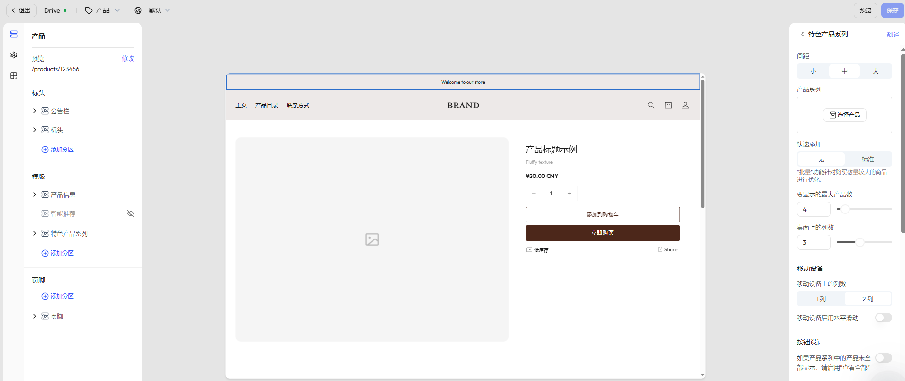

# 产品

产品详情页是转化率的关键页面，承载产品展示、购买操作与推荐内容。本页将帮助您理解其结构、编辑方式以及自定义能力。

## 步骤一：选择页面

在编辑器顶部导航栏，点击 **主页** 右侧的下拉箭头，可展开当前市场下支持的页面类型列表。
- 选择 **产品** -> **默认产品**，进入默认的产品详情模版。

## 步骤二：选择具体产品进行预览

- 选择页面模版后，系统将自动加载当前模版并展示预览效果。
- 如需查看真实展示效果，可点击左上角模版名称下的 **修改**，从已发布产品中选择具体产品进行预览。

## 步骤三：查看并编辑页面结构

在左侧操作面板中，可查看当前页面的模块结构，默认包含以下内容：

- [标头](./operate-store-design-themes-edit-guide-header.md)：公告栏、顶部菜单等。
- [页脚](./operate-store-design-themes-edit-guide-footer.md)：底部区域，通常包含订阅、版权、政策链接等内容。
- **模版**：产品详情页的主要内容载体，根据不同模版风格，可能由以下分区组合而成：
	- **产品信息**：可设置产品标题、厂商和物流、价格、标签、库存与 [快捷购买按钮（Buy Button）](./operate-payments-accelerated-checkouts.md) 等。支持自由组合区块，构建个性化内容结构。
	- **智能推荐**：系统根据用户行为和产品属性自动推荐相关产品。
	- **特色产品系列**：用于展示精选系列产品。

### 价格设置

在 **产品信息** 的 **价格** 区块中，您可以通过装修编辑器进行全局配置：  

  - **显示划线价**：设置是否显示对比价格。  
  - **价格字体规格**：支持小/中/大/特大四种尺寸，满足不同视觉需求。
  - **价格样式强化**：可开启加粗展示，突出销售价格，提升转化效果。
  - **税费展示**：设置是否显示税费说明。  
  - **产品徽标**：开启或关闭徽标，支持样式自定义。
  - **优惠标签**：可选择 Sale 或 Save 样式，  并支持按折扣比例或优惠金额展示。 

#### 徽标展示

除了在 **价格** 区块的展示设置，您还可以在 **样式设计** 面板中（最左侧功能导航栏中的第三个图标）中配置徽标，用于突出促销、优惠或品牌特色。您可在 **产品卡** 下找到 **徽标** 部分：

- **开关控制**：支持开启或关闭徽标显示。
- **徽标位置**：可选择左上方 / 右上方 / 左下方 / 右下方，灵活贴合页面设计。
- **徽标样式**：提供多种样式选项（如样式 1、样式 2），满足不同视觉需求。
- **优惠标签类型**：可选择 _Sale 标签_ 或 _Save 标签_。
- **优惠标签展示方式**：支持「显示优惠比例」或「显示优惠金额」。
- **徽标颜色方案**：可选择主题色、主色、辅助色、点缀色等，增强品牌一致性。

### 展示标签

展示标签用于突出产品的关键特性与卖点，功能默认开启，无需额外配置。默认展示在在产品标题的上方，可通过拖曳调整展示位置。

### 粘性购物车（移动端）
移动端粘性购物车是在客户浏览产品详情页时，始终固定展示在页面底部的快捷购买区域。即使客户向下滚动查看详情，也可随时进行加购或购买操作，从而减少操作步骤，提升转化率。
移动端粘性购物车功能默认开启，无需额外配置，默认位于模板底部，可拖曳调整其展示位置。
启用后：
- 针对多规格产品，当客户点击粘性购物车中的 **加入购物车** 或 **立即购买** 按钮时，系统将自动弹出规格选择弹框。
- 弹框中展示以下关键信息：产品规格图片（缩略图）、产品名称、已选规格信息（如颜色 / 尺码）、价格，客户完成规格确认后，可直接完成加购或下单。

## 步骤四：拓展分区及应用

在默认分区基础上，您还可以根据业务需求进一步拓展产品详情页内容。通过添加分区，您可以插入图片、视频、富文本等内容模块，打造更具品牌感和信息层次的页面结构。

### 添加分区

在 模版 区域点击 **添加分区**，可从以下模块中选择所需内容类型：

|分区类型|说明|
|---|---|
|图片横幅|展示品牌大图或促销视觉|
|视频|插入品牌故事或产品介绍|
|联系表|引导用户填写咨询/反馈表单|
|富文本|添加品牌理念、产品说明等文本内容|
|邮件注册|添加邮件订阅入口|
|特色产品|推荐其他重点商品|
|分隔线|用于模块之间的视觉隔断|
|多列布局|自定义图文组合排版|
|博客文章|嵌入内容营销文章|
|带文本的图片|图文组合式展示品牌信息或引导 CTA|

::: tip

为了更好满足商家多样化的页面设计需求，我们会持续根据用户反馈迭代新增分区与区块组件。因此，页面中实际可用的内容组件可能会与本帮助文档略有出入，建议以编辑器中的实际内容为准。此外，不同主题模版可能会展示不同的区块样式和功能，敬请留意。

:::

### 拓展应用

在 **添加分区/添加区块** 弹窗中，点击 **应用** 页签，可添加功能型应用模块，如：

- 关联推荐
- 畅销产品
- 大家都在看
- 流行趋势等

## 步骤五：配置内容与样式

在完成页面结构搭建后，您可以进一步配置各分区和块，以实现更贴合品牌形象与用户需求的展示效果。您可点击任一分区和区块，在页面右侧进行配置：

- 自定义内容文本、样式、排列顺序
- 设置品牌色调、显示条件、图片展示方式等

如需添加更多内容，您可点击各分区下的 **添加块**，根据需求添加，例如：

- 分隔线：增强视觉分层
- 可折叠行：展示 FAQ、警示说明、退换信息等
- 厂商信息：增强产品信任度
