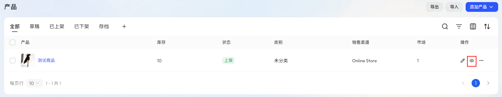
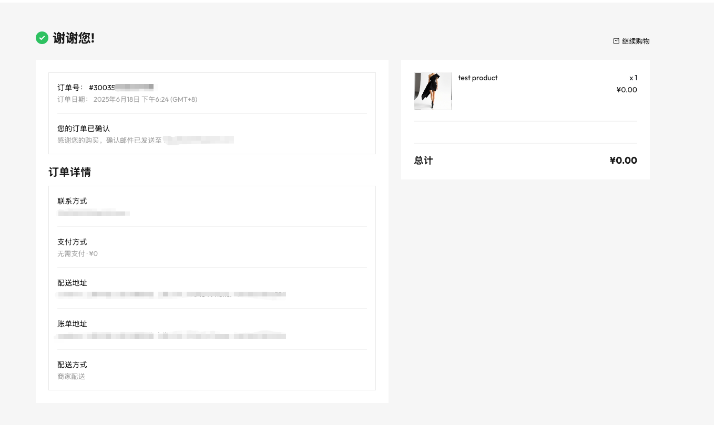
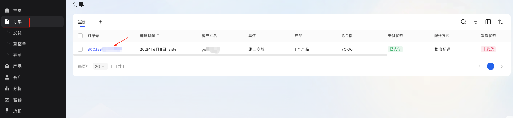

# **创建一笔测试订单**

在店铺正式上线前，你可以通过创建一笔测试订单，验证产品展示、下单流程、收货信息填写、支付与订单生成等关键环节是否正常运行。 

::: tip

建议在订单备注中标注“测试订单”，便于后续识别和管理。

:::

## 步骤 1：发布 0 元测试产品

为方便测试下单流程，您只需创建一个最基础的产品，设定价格为 0 元并上架即可。

### 操作步骤：

1. 登录 Genstore 商家后台，点击 **商店** -> **产品**。
2. 点击右上角 **添加产品**，选择产品类型（如 **实物产品**）。
3. 填写以下基础信息：
	- **产品标题**：如 “测试产品”
	- **上传图片**：上传任意示意图
	- **价格**：保留默认，即为 `0`
4. 确保产品状态为 **上架**。
5. 点击 **保存**。

关于产品的更多功能介绍，见 [产品](./operate-product.md)。

## 步骤 2：预览测试商品

即使您尚未装修店铺，仍可通过产品的预览页面完成下单流程测试，系统将以默认主题展示产品页面，方便您提前验证交易路径。
返回产品管理页，点击预览按钮，查看产品对买家的展示效果。

## 步骤3：测试买家购买结算流程

在预览页面点击 **立即购买**，进入结算流程。根据提示填写买家信息，包括邮箱、姓名、收货地址等。

填写完成后，点击 **立即支付** 完成下单。系统将跳转至订单确认页，可查看订单号、联系方式、配送方式、账单地址、邮编等信息。

## 步骤4：查看测试订单

返回 Genstore 商家后台，点击左侧导航中的 **商店** -> **订单**，即可查看生成的测试订单。点击订单号可进入订单详情页。您可点击 **备注** 后的编辑按钮，为当前订单添加备注，如 "测试订单"。

您还可继续对该测试订单执行发货、退货、退款、换货等操作，以完整验证交易流程的可用性。关于订单的更多操作说明，见 [管理订单](./operate-orders.md)
